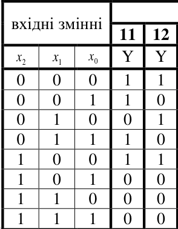
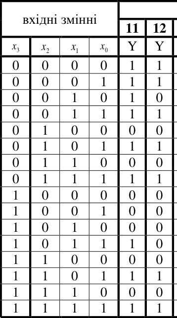
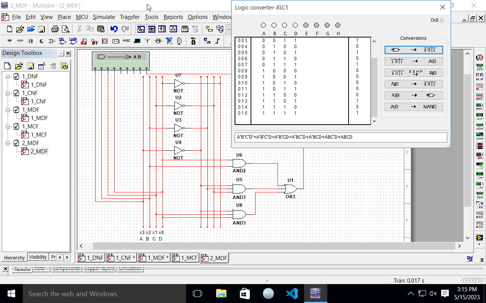
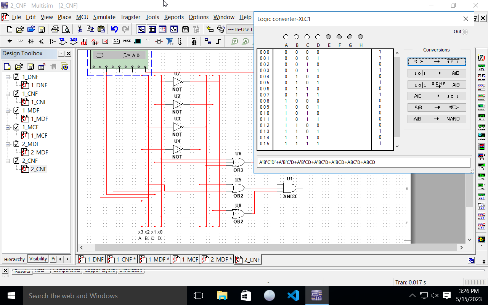
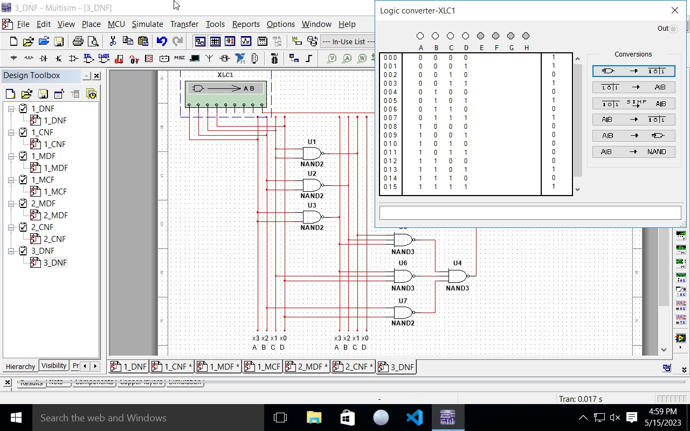
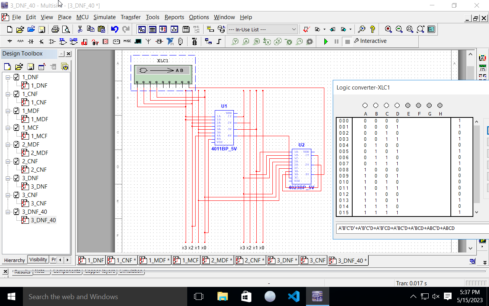
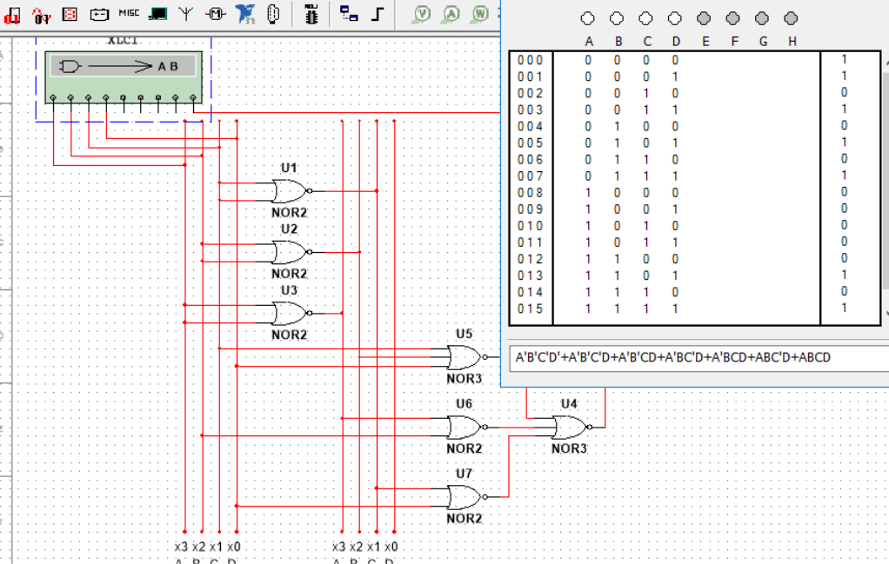
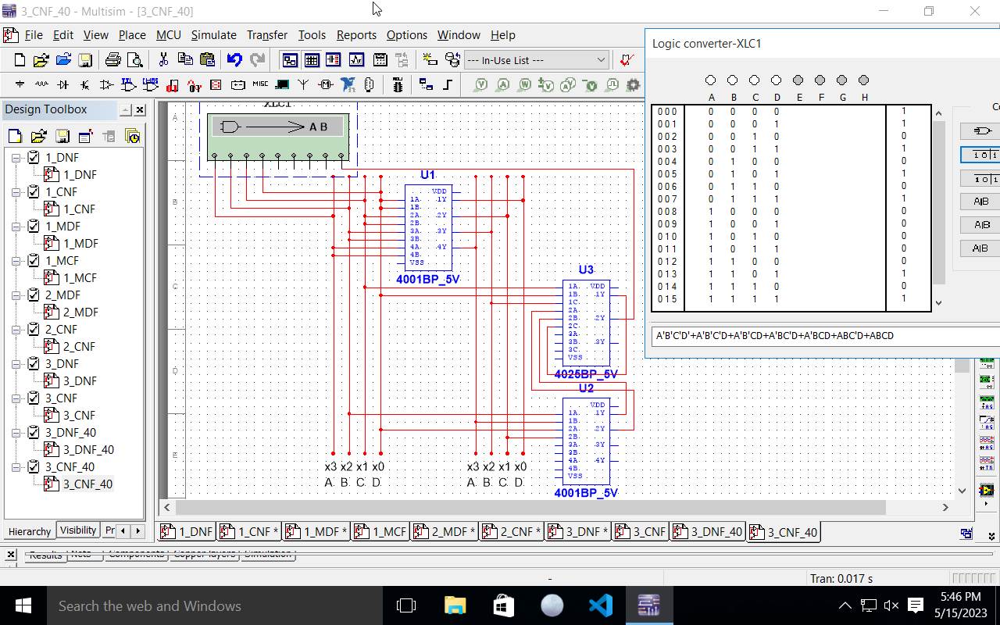

---
header-includes:
- \input{$HOME/Templates/lpnu_doc_templates/settings/preamble_md.tex}
- \input{$HOME/Templates/lpnu_doc_templates/settings/minted_settings.tex}
- \newcommand\Variant{12}
- \newcommand\Date{22.05.\the\year}
- \newcommand\Discipline{Комп'ютерна схемотехніка та архітектура комп'ютерних систем}
- \newcommand\Instructor{Чкалов О. В.}
- \newcommand\Type{\Lab}
- \newcommand\Number{3}
- \newcommand\Topic{Мінімізація логічних функцій з допомогою Карт Карно. Приведення логічних функцій до одного базису}
- \usetikzlibrary{tikzmark}
---

\input{$HOME/Templates/lpnu_doc_templates/parts/header.tex}
вивчення методів проектування комбінаційних схем в
заданому базисі логічних елементів.

# Індивідуальне завдання

## Завдання 1. Мінімізація функції трьох змінних

1.   Задано логічну функцію від трьох змінних за допомогою таблиці істинності.
2. Для значення функції Y записати логічне рівняння у вигляді досконалої диз’юнктивної нормальної форми (ДДНФ).
3. Для значення функції Y записати логічне рівняння у вигляді досконалої кон’юнктивної нормальної форми (ДКНФ).
4. У програмі NI Multisim побудувати дві схеми: ДДНФ та ДКНФ.
5. З допомогою карт Карно  провести мінімізацію даних логічних функцій та отримати мінімізовану диз’юнктивну форму (МДФ), мінімізовану кон’юнктивну форму (МКФ).
6. У програмі NI Multisim побудувати дві схеми: МДФ та МКФ.
Подаючи на входи комбінаційних схем всі можливі значення аргументів
від генератора слова (Word Generator), перевірити їх функціонування, задаючи
всі  комбінації вхідних змінних.

{width=3cm}

## Завдання 2. Мінімізація функції чотирьох змінних

1. Задано логічну функцію від чотирьох змінних за допомогою таблиці істинності (див. номер свого варіанту).
2. З допомогою карт Карно провести мінімізацію даної функції та отримати: мінімізовану диз’юнктивну форму (МДФ); мінімізовану кон’юнктивну форму (МКФ).
3. У програмі NI Multisim побудувати дві схеми: МДФ та МКФ.

{width=4cm}

## Завдання 3. Приведення до одного базису І-НЕ та ЧИ-НЕ

1. Привести до базису І-НЕ логічну функцію МДФ чотирьох змінних.
2. Привести до базису ЧИ-НЕ логічну функцію МКФ чотирьох змінних.
3. Скласти відповідні схеми в NI Multisim.
4. Скласти відповідні схеми в NI Multisim, використавши мікросхеми 40 серії. Відомості про мікросхеми даної серії приведені в лабораторній роботі 2.

# Етапи розв'язку

## Завдання 1

### ДДНФ
$$
	\bar x_2\bar x_1\bar x_0+
	\bar x_2 x_1\bar x_0+
	x_2\bar x_1\bar x_0
$$

### ДКНФ
$$
	(x_2 + x_1 + \bar x_0)
	(x_2+\bar x_1+\bar x_0)
	(\bar x_2+x_1+\bar x_0)
	(\bar x_2+\bar x_1+x_0)
	(\bar x_2+\bar x_1+\bar x_0)
$$

{width=15cm}

\clearpage

### МДФ

\begin{table}[h]
\centering
\begin{tabular}{c|c|c}
	\hline
	& $x_0$ \\
	\hline
	$x_2x_1$ & 0 & 1 \\
	\hline
	$00$ & \tikzmark{startup} \tikzmark{startdown} 1 \tikzmark{enddown} \\
	$01$ & 1 \tikzmark{endup}
 \\
	$11$ &\\
	$10$ & \tikzmark{start3}1\tikzmark{end3} \\
	\hline
\end{tabular}
\caption{карта для МДФ}
\end{table}

\begin{tikzpicture}[remember picture,overlay]
\foreach \Val in {down}
{
\draw[rounded corners,green,thick]
([shift={(-0.5\tabcolsep,2.5ex)}]pic cs:start\Val)
    rectangle
  ([shift={(0.5\tabcolsep,-1ex)}]pic cs:end\Val);
\draw[rounded corners,white,thick,fill]
  ([shift={(-0.5\tabcolsep,2.6ex)}]pic cs:start\Val)
    rectangle
  ([shift={(0.5\tabcolsep,2.1ex)}]pic cs:end\Val);
}

\foreach \Val in {3}
{
\draw[rounded corners,green,thick]
([shift={(-0.5\tabcolsep,2ex)}]pic cs:start\Val)
    rectangle
  ([shift={(0.5\tabcolsep,-2ex)}]pic cs:end\Val);
\draw[rounded corners,white,thick,fill]
  ([shift={(-0.5\tabcolsep,-1.5ex)}]pic cs:start\Val)
    rectangle
  ([shift={(0.5\tabcolsep,-2ex)}]pic cs:end\Val);
}

\foreach \Val in {up}
{
\draw[rounded corners,red,thick]
  ([shift={(-0.5\tabcolsep,2.2ex)}]pic cs:start\Val)
    rectangle
  ([shift={(0.5\tabcolsep,-1.3ex)}]pic cs:end\Val);
}
\end{tikzpicture}

$$
	\begin{aligned}
	0\cancel00~0\cancel10\implies \bar x_2 \bar x_0; \\
	\cancel000~\cancel100\implies \bar x_1 \bar x_0; \\
	\bar x_2 \bar x_0 + \bar x_1 \bar x_0
	\end{aligned}
$$

\clearpage

### МКФ

\begin{table}[h]
\centering
\begin{tabular}{c|c|c}
	\hline
	& $x_0$ \\
	\hline
	$x_2x_1$ & 0 & 1 \\
	\hline
	$00$ & & \tikzmark{startmeow}0 \\
	$01$ & & 0 \\
	$11$ & \tikzmark{startgav} 0 & 0 \tikzmark{endgav}  \\
	$10$ & & 0 \tikzmark{endmeow}\\
	\hline
\end{tabular}
\caption{карта для МКФ}
\end{table}

\begin{tikzpicture}[remember picture,overlay]
\foreach \Val in {gav}
{
\draw[rounded corners,green,thick]
([shift={(-0.2\tabcolsep,2ex)}]pic cs:start\Val)
    rectangle
  ([shift={(0.2\tabcolsep,-.5ex)}]pic cs:end\Val);
}

\foreach \Val in {meow}
{
\draw[rounded corners,red,thick]
  ([shift={(-0.5\tabcolsep,2.2ex)}]pic cs:start\Val)
    rectangle
  ([shift={(0.5\tabcolsep,-1.3ex)}]pic cs:end\Val);
}
\end{tikzpicture}

$$
	\begin{aligned}
	\cancel0\cancel01~\cancel0\cancel11~\cancel1\cancel11~\cancel1\cancel01\implies \bar x_0; \\
	11\cancel0~11\cancel1\implies \bar x_2+\bar x_1; \\
	(\bar x_2+\bar x_1) \cdot \bar x_0
	\end{aligned}
$$

\clearpage

## Завдання 2

### МДФ

\begin{table}[h]
\centering
\begin{tabular}{c|c|c|c|c}
	\hline
	& $x_1x_0$ \\
	\hline
	$x_3x_2$ & 00 & 01 & 11 & 10 \\
	\hline
	00 & \tikzmark{startgag}1 & 1\tikzmark{endgag} & \tikzmark{startbub}1\\
	01 & & \tikzmark{startnunm}1 & 1 \tikzmark{endbub}\\
	11 & & 1 & 1 \tikzmark{endnunm}\\
	10 & & \\
	\hline
\end{tabular}
\caption{карта для МДФ функції 4-х змінних}
\end{table}

\begin{tikzpicture}[remember picture,overlay]
\foreach \Val in {gag}
{
\draw[rounded corners,green,thick]
([shift={(-0.2\tabcolsep,2ex)}]pic cs:start\Val)
    rectangle
  ([shift={(0.2\tabcolsep,-.5ex)}]pic cs:end\Val);
}

\foreach \Val in {nunm}
{
\draw[rounded corners,red,thick]
  ([shift={(-0.5\tabcolsep,2.2ex)}]pic cs:start\Val)
    rectangle
  ([shift={(0.5\tabcolsep,-1.3ex)}]pic cs:end\Val);
}

\foreach \Val in {bub}
{
\draw[rounded corners,violet,thick]
  ([shift={(-0.5\tabcolsep,2.2ex)}]pic cs:start\Val)
    rectangle
  ([shift={(0.3\tabcolsep,-1.3ex)}]pic cs:end\Val);
}
\end{tikzpicture}

$$
	\bar x_3 \bar x_2 \bar x_1 + \bar x_3 x_1 x_0 + x_2 x_0
$$

\clearpage

### МКФ

\begin{table}[h]
\centering
\begin{tabular}{c|c|c|c|c}
	\hline
	& $x_1x_0$  \\
	\hline
	$x_3x_2$ & 00 & 01 & 11 & 10 \\
	\hline
	00 &   &   &   & \tikzmark{startgad}0 \\
	01 & \tikzmark{startgaw}0 &   &   & 0 \\
	11 & 0\tikzmark{endgaw} &   &   & 0 \\
	10 & \tikzmark{startgar}0 & 0 & 0 & 0\tikzmark{endgar}\tikzmark{endgad} \\
	\hline
\end{tabular}
\caption{карта для МКФ функції 4-х змінних}
\end{table}

\begin{tikzpicture}[remember picture,overlay]
\foreach \Val in {gaw}
{
\draw[rounded corners,green,thick]
([shift={(-0.2\tabcolsep,2ex)}]pic cs:start\Val)
    rectangle
  ([shift={(0.2\tabcolsep,-.5ex)}]pic cs:end\Val);
}

\foreach \Val in {gar}
{
\draw[rounded corners,red,thick]
  ([shift={(-0.5\tabcolsep,2.2ex)}]pic cs:start\Val)
    rectangle
  ([shift={(0.5\tabcolsep,-1.3ex)}]pic cs:end\Val);
}

\foreach \Val in {gad}
{
\draw[rounded corners,violet,thick]
  ([shift={(-0.5\tabcolsep,2.2ex)}]pic cs:start\Val)
    rectangle
  ([shift={(0.3\tabcolsep,-1.3ex)}]pic cs:end\Val);
}
\end{tikzpicture}

$$
	Y = (\bar x_2 + x_1 + x_0) (\bar x_3 + x_2) (\bar x_1 + x_0)
$$

## Завдання 3

### МДНФ у базисі І-НЕ

$$
		Y = \bar x_3 \bar x_2 \bar x_1 + \bar x_3 x_1 x_0 + x_2 x_0 \implies
		\overline{\overline Y}=
		\overline
		{
			\overline{\bar x_3 \bar x_2 \bar x_1} \cdot
			\overline{\bar x_3 x_1 x_0} \cdot
			\overline{\vphantom{.5pt}x_2 x_0}
		}
$$

### МКНФ у базисі ЧИ-НЕ

$$
		Y = (\bar x_2 + x_1 + x_0) (\bar x_3 + x_2) (\bar x_1 + x_0)
		\implies
		\overline{\overline Y}=
		\overline
		{
			\overline{(\bar x_2 + x_1 + x_0)} +
			\overline{(\bar x_3 + x_2)} +
			\overline{(\bar x_1 + x_0)}
		}
$$

# Висновок

Я пригадав принципи мінімізації логічних функцій та
використавши ці знання виконав поставлені завдання.
