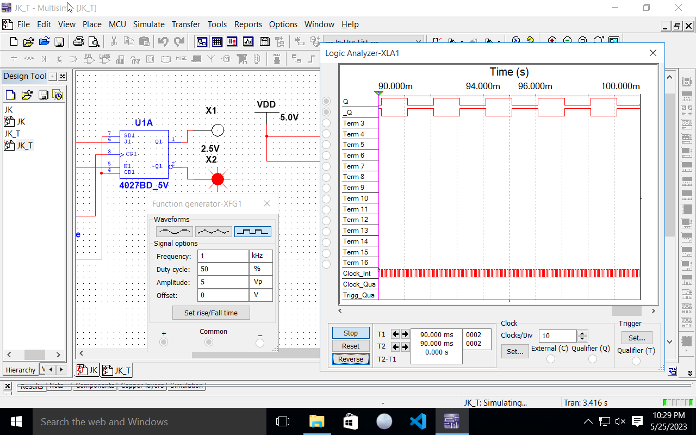

---
header-includes:
- \input{$HOME/Templates/lpnu_doc_templates/settings/preamble_md.tex}
- \input{$HOME/Templates/lpnu_doc_templates/settings/minted_settings.tex}
- \newcommand\Variant{12}
- \newcommand\Date{26.05.\the\year}
- \newcommand\Discipline{Комп'ютерна схемотехніка та архітектура комп'ютерних систем}
- \newcommand\Instructor{Чкалов О. В.}
- \newcommand\Type{\Lab}
- \newcommand\Number{4}
- \newcommand\Topic{Дослідження тригерів}
---

\input{$HOME/Templates/lpnu_doc_templates/parts/header.tex}
дослідити будову та принципи роботи RS-, JK-, D- та T-
тригерів.

# Індивідуальне завдання

**Завдання 1.** Дослідження RS-тригера з прямими входами.

Увімкнути схему. Послідовно подати на схему наступні сигнали: S= 0, R=
1; S= 0, R = 0; S= 1, R= 0; S= 0, R= 0. За результатами експерименту
заповнити таблицю істинності та описати режими роботи RS-тригера з
прямими входами для схеми на рис. 1. Отримати часові діаграми для
RS-тригера. Пояснити принцип роботи RS-тригера.

**Завдання 2.** Дослідження RS-тригера з інверсними входами.

Увімкнути схему. Послідовно подати на схему наступні сигнали: S = 1, R =
0; S = 1, R = 1; S = 0, R = 1; S = 1, R = 1. За результатами
експерименту заповнити таблицю істинності та описати режими роботи
RS-тригера з інверсними входами для схеми на рис. 2. Отримати часові
діаграми для RS-тригера. Пояснити принцип роботи RS-тригера з інверсними
входами.

**Завдання 3.** Дослідження JK-тригера

Увімкнути схему. Послідовно подати на схему наступні сигнали: S = 0, R=
1; S = 1, R= 0. Встановити S = 1, R = 1 та перевірити справедливість
таблиці функцій збудження. За результатами експерименту заповнити
таблицю істинності та описати режими роботи JK-тригера для схеми на рис.
3. Отримати часові діаграми для JK-тригера. Пояснити принцип роботи
JK-тригера.

**Завдання 4.** Дослідження JK-тригера в лічильному режимі (Т-тригер)
Зібрати схему. Увімкнути схему. Змінюючи стан лічильного входу С
відповідним перемикачем, отримати часові діаграми роботи Т-тригера.
Пояснити принцип роботи даного тригера.

**Завдання 5.** Дослідження D-тригера

Увімкнути схему. Подати на схему наступні сигнали: S = 0, R = 1; S = 1,
R = 0. Встановити S = 1, R = 1 та перевірити справедливість таблиці
функції збудження для даної схеми. Отримати часові діаграми роботи
тригера для усіх можливих комбінацій Dt , Qt .

**Завдання 6.** Дослідження роботи D-тригера в лічильному режимі

Увімкніть схему. Подаючи на лічильний вхід С тактові імпульси за
допомогою відповідного перемикача та визначаючи рівні логічних сигналів
на виходах тригера за допомогою логічних пробників, отримати часові
діаграми роботи D-тригера в лічильному режимі. Пояснити принцип роботи
даного тригера.

# Етапи розв'язку

## Завдання 1

-----------------------------------------------------------------------
Таблиця істиності
----------------- ----------------- ----------------- -----------------
$R$                 $S$                 $Q$                 $!Q$

0                 0                 $Q_{t-1}$            $!Q_{t-1}$

1                 0                 0                 1

0                 1                 1                 0

1                 1                 \*                \*
-----------------------------------------------------------------------

\clearpage

## Завдання 2

Часова діаграма на рис. 2

-----------------------------------------------------------------------
Таблиця істиності
----------------- ----------------- ----------------- -----------------
$R$                 $S$                 $Q$                 $!Q$

1                 1                 $Q_{t-1}$            $!Q_{t-1}$

0                 1                 0                 1

1                 0                 1                 0

0                 0                 \*                \*
-----------------------------------------------------------------------

\clearpage
## Завдання 3

-----------------------------------------------------------------------
Таблиця істиності
----------------- ----------------- ----------------- -----------------
$J$                 $K$                 $Q_t$                 $Q_{t+1}$

0                 0                 0                 0

0                 0                 1                 1

0                 1                 0                 0

0                 1                 1                 0

1                 0                 0                 1

1                 0                 1                 1

1                 1                 0                 1

1                 1                 1                 0
-----------------------------------------------------------------------

\clearpage

## Завдання 4

\clearpage

## Завдання 5

{width=14cm}

## Завдання 6

{width=14cm}

\clearpage

# Висновок

У цій роботі я дослідив найпоширеніші тригери
