---
header-includes:
- \input{$HOME/Templates/lpnu_doc_templates/settings/preamble_md.tex}
- \input{$HOME/Templates/lpnu_doc_templates/settings/minted_settings.tex}
- \newcommand\Variant{12}
- \newcommand\Date{29.05.\the\year}
- \newcommand\Discipline{Комп'ютерна схемотехніка та архітектура комп'ютерних систем}
- \newcommand\Instructor{Чкалов О. В.}
- \newcommand\Type{\Lab}
- \newcommand\Number{5}
- \newcommand\Topic{Проектування регістрів зсуву}
---

\input{$HOME/Templates/lpnu_doc_templates/parts/header.tex}
дослідити роботу та принципи побудови послідовних та
паралельних регістрів.

# Індивідуальне завдання

## Завдання 1-4

1. Спроектувати послідовний регістр зсуву вправо заданої розрядності на
базі D-тригерів з попередніми установками. Записати в нього задану двійкову
комбінацію чисел.
2. Спроектувати послідовний регістр зсуву вправо заданої розрядності на
базі мікросхеми 7474. Записати в нього задану двійкову комбінацію чисел.
3. Спроектувати послідовний регістр зсуву вліво заданої розрядності на
базі D-тригерів з попередніми установками. Записати в нього задану двійкову
комбінацію чисел.
4. Спроектувати послідовний регістр зсуву вліво заданої розрядності на
базі мікросхеми 7474. Записати в нього задану двійкову комбінацію чисел.

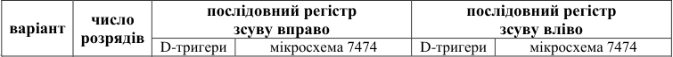
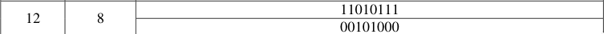

## Завдання 5-7

5. Спроектувати послідовний 8-розрядний регістр зсуву вправо на базі
мікросхеми 74198. Записати в нього задану двійкову комбінацію чисел.
6. Спроектувати послідовний 8-розрядний регістр зсуву вліво на базі
мікросхеми 74198. Записати в нього задану двійкову комбінацію чисел.
7. Спроектувати паралельний 8-розрядний регістр на базі мікросхеми 74198. Записати в нього задану двійкову комбінацію чисел.

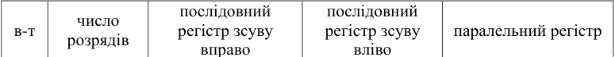
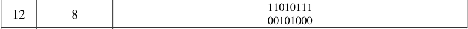

# Знімки екрану зі схемами

## Завдання 1
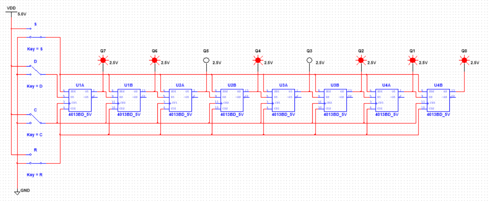

## Завдання 2
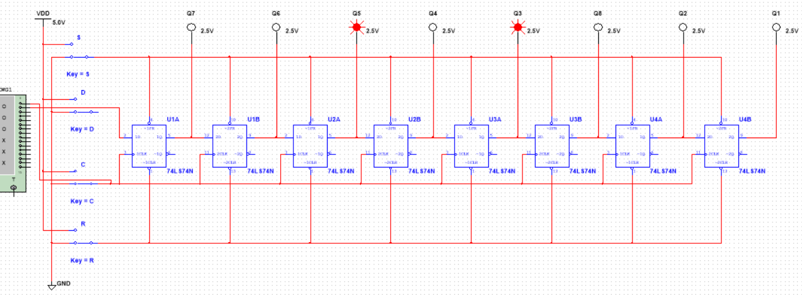

\clearpage

## Завдання 3
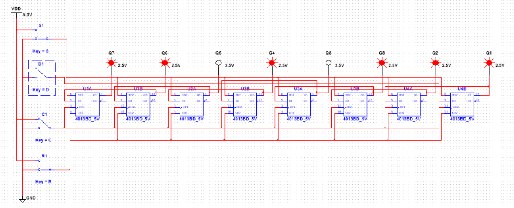

## Завдання 4
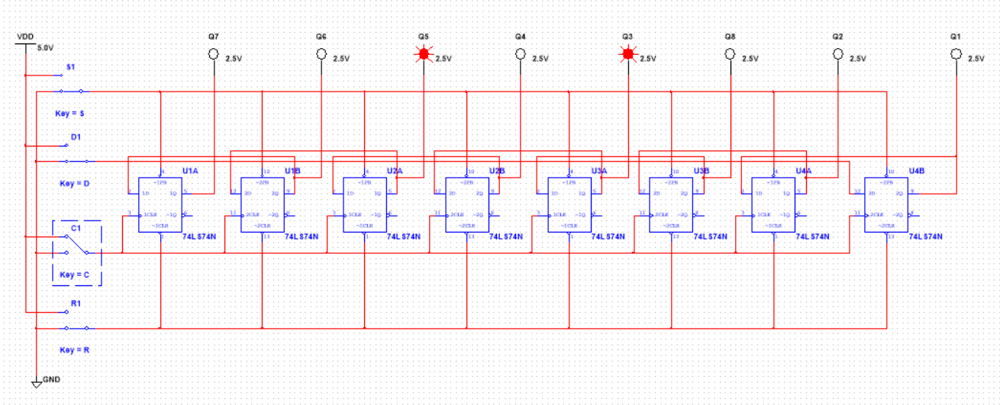

\clearpage

## Завдання 5
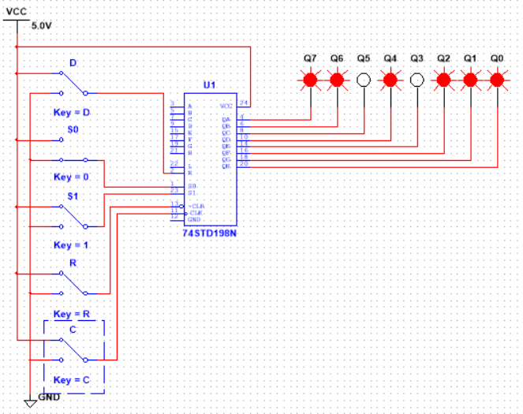{width=11cm}

## Завдання 6
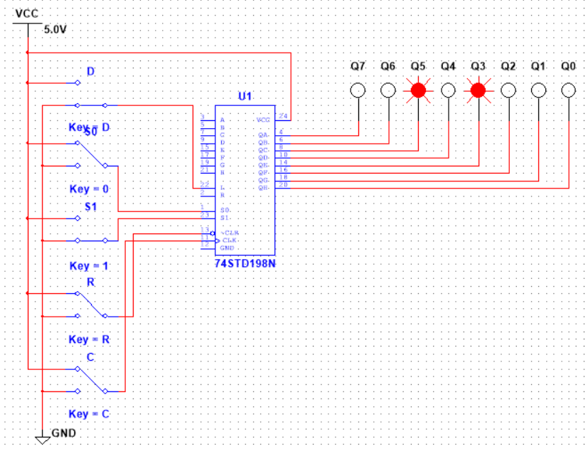{width=11cm}

\clearpage

## Завдання 7

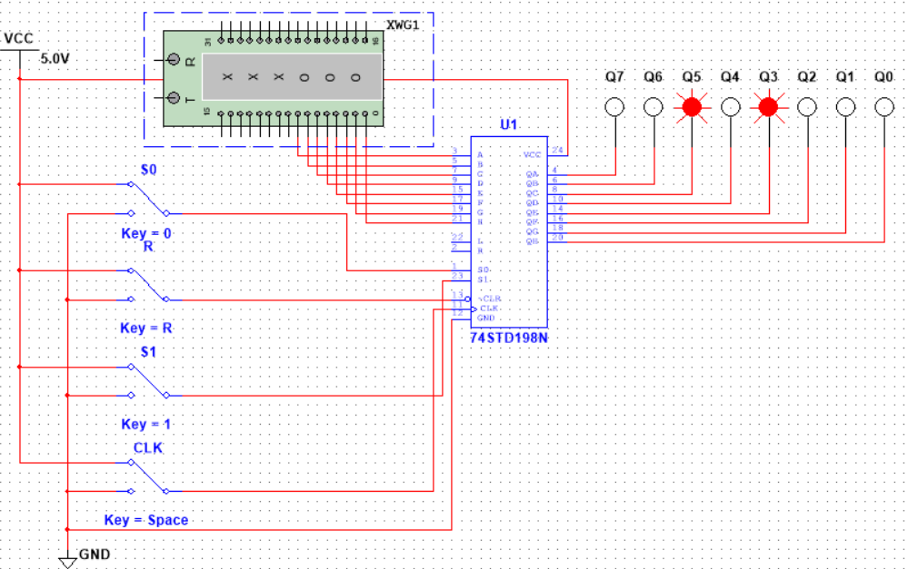{width=11cm}

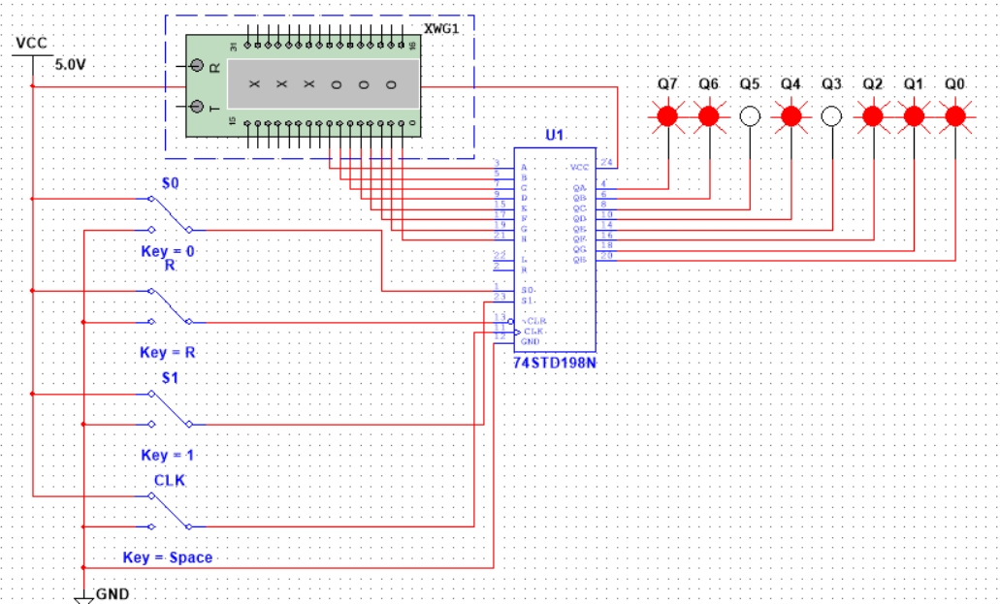{width=11cm}

# Висновок

Я дослідив та побудував восьмирозрядні регістри зсуву вправо та вліво
на основі d-тригерів та мікросхем 74LS74N та 74198. Також реалізував за допомогою мікросхеми 74198 паралельний регістр зсуву.
