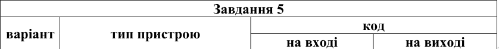

---
header-includes:
- \input{$HOME/Templates/lpnu_doc_templates/settings/preamble_md.tex}
- \input{$HOME/Templates/lpnu_doc_templates/settings/minted_settings.tex}
- \newcommand\Variant{12}
- \newcommand\Date{\the\day.\the\month.\the\year}
- \newcommand\Discipline{Комп'ютерна схемотехніка та архітектура комп'ютерних систем}
- \newcommand\Instructor{Чкалов О. В.}
- \newcommand\Type{\Lab}
- \newcommand\Number{6}
- \newcommand\Topic{Проектування дешифраторів}
---

\input{$HOME/Templates/lpnu_doc_templates/parts/header.tex}
вивчення принципів проектування дешифраторів в заданому
базисі логічних елементів, а також дослідження функціонування спроектованих
дешифраторів.

# Індивідуальне завдання

1. Спроектувати лінійний дешифратор із заданим числом та типом входів/виходів.
2. Спроектувати пірамідальний дешифратор із заданим числом та типом входів/виходів.
3. Спроектувати матричний дешифратор із заданим числом та типом входів/виходів.
4. На основі каскадного з’єднання дешифраторів із заданим числом та типом входів/виходів спроектувати заданий дешифратор.
5. Побудувати лінійний неповний дешифратор для переводу двійкових чисел із заданого коду в десятковий код в базисах
	1. І, ЧИ, НЕ.
	2. І-НЕ.
	3. ЧИ-НЕ.

\clearpage

# Етапи розв'язку

## Завдання 1

\clearpage

## Завдання 2

\clearpage

## Завдання 3

\clearpage

## Завдання 4

\clearpage

## Завдання 5

\clearpage

# Висновок

В цій лабораторній роботі я дослідив та побудував 5 дешифраторів,
один з них --- у трьох базисах.
