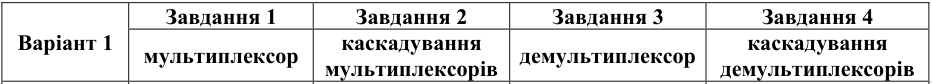
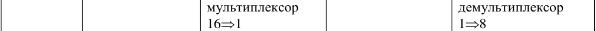

---
header-includes:
- \input{$HOME/Templates/lpnu_doc_templates/settings/preamble_md.tex}
- \input{$HOME/Templates/lpnu_doc_templates/settings/minted_settings.tex}
- \newcommand\Variant{12}
- \newcommand\Date{2.6.\the\year}
- \newcommand\Discipline{Комп'ютерна схемотехніка та архітектура комп'ютерних систем}
- \newcommand\Instructor{Чкалов О. В.}
- \newcommand\Type{\Lab}
- \newcommand\Number{7}
- \newcommand\Topic{ПРОЕКТУВАННЯ МУЛЬТИПЛЕКСОРІВ ТА ДЕМУЛЬТИПЛЕКСОРІВ}
- \graphicspath{{images/}}
---

\input{$HOME/Templates/lpnu_doc_templates/parts/header.tex}
дослідити роботу та принципи побудови мультиплексорів та
демультиплексорів.

1. Спроектувати мультиплексор (див. індивідуальні завдання)
2. На основі каскадування мультиплексорів спроектувати мультиплексор з
більшим числом входів (див. індивідуальні завдання).
3. Спроектувати демультиплексор (див. індивідуальні завдання).
4. На основі каскадування демультиплексорів спроектувати демультиплексор з більшим числом виходів (див. індивідуальні завдання).

# Індивідуальне завдання

\clearpage

# Етапи розв'язку

## Завдання 1
{width=9cm}

{width=12cm}

\clearpage

## Завдання 2

\clearpage

## Завдання 3
{width=11cm}

\clearpage

## Завдання 4
{width=15cm}

\clearpage

# Висновок

Я зрозумів принципи роботи мультиплексорів та демультиплексорів,
спроєктував та наростив (де)мультиплексори, вказані в індивідуальному завданні.
