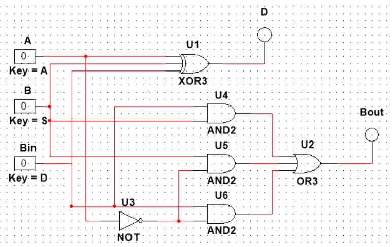

---
header-includes:
- \input{$HOME/Templates/lpnu_doc_templates/settings/preamble_md.tex}
- \input{$HOME/Templates/lpnu_doc_templates/settings/minted_settings.tex}
- \newcommand\Variant{12}
- \newcommand\Date{9.6.\the\year}
- \newcommand\Discipline{Комп'ютерна схемотехніка та архітектура комп'ютерних систем}
- \newcommand\Instructor{Чкалов О. В.}
- \newcommand\Type{\Lab}
- \newcommand\Number{8}
- \newcommand\Topic{ДОСЛІДЖЕННЯ КОМПАРАТОРІВ, СУМАТОРІВ, ВІДНІМАЮЧИХ ПРИСТРОЇВ}
---

\input{$HOME/Templates/lpnu_doc_templates/parts/header.tex}
вивчення особливостей функціонування цифрових компараторів, суматорів, віднімаючих пристроїв, їх синтез та комп’ютерне
моделювання.

# Індивідуальне завдання

## Завдання 1.

Спроектувати багаторозрядний компаратор для порівняння
вхідних змінних з константою. Варіанти завдань приведені в індивідуальних
завданнях (табл. 6.2).

## Завдання 2.

Спроектувати багаторозрядний компаратор для порівняння
двох двійкових слів на рівність. Варіанти завдань приведені в індивідуальних
завданнях (табл. 6.3).

{width=7cm}

## Завдання 3.
Зібрати схему напівсуматора:

- на базі основних логічних елементів;
- на базі логічних елементів І та нееквівалентність;
- на елементах І-НЕ.

Підключити до входу схеми генератор слова і задати послідовність 00, 01, 10, 11. До виходів схеми $\sum$
та $C_0$ приєднати логічні пробники. Дослідити
роботу напівсуматора. Побудувати таблицю істинності напівсуматора.

## Завдання 4.
Зібрати схему повного суматора. Провести дослідження
роботи повного суматора.

## Завдання 5.
Зібрати схему напіввіднімаючого пристрою (Nvp). Провести
дослідження його роботи.

## Завдання 6.
Зібрати схему повного віднімаючого пристрою (Pvp).
Провести дослідження його роботи.

## Завдання 7.
Спроектувати багаторозрядні паралельні суматори,
віднімаючі пристрої, віднімаючі пристрої на суматорах та комбіновані
суматори-віднімаючі пристрої. Варіанти завдань приведені в індивідуальних
завданнях (табл. 6.4).

# Етапи розв'язку

## Завдання 1

| $B_4$ | $B_3$   | $B_2$   | $B_1$   | $B_0$   | $A$ |
| ----- | ------- | ------- | ------- | ------- | --- |
| 0     | 0       | 0       | 0       | 0       | >   |
| 0     | 0       | 0       | 0       | 1       | >   |
| 0     | 0       | 0       | 1       | 0       | =   |
| 0     | 0       | 0       | 1       | 1       | <   |
| 0     | 0       | 1       | 0       | 0       | <   |
| 0     | 0       | 1       | 0       | 1       | <   |
| 0     | 0       | 1       | 1       | 0       | <   |
| 0     | 0       | 1       | 1       | 1       | <   |
| 0     | 1       | 0       | 0       | 0       | <   |
| 0     | 1       | 0       | 0       | 1       | <   |
| 0     | 1       | 0       | 1       | 0       | <   |
| 0     | 1       | 0       | 1       | 1       | <   |
| 0     | 1       | 1       | 0       | 0       | <   |
| 0     | 1       | 1       | 0       | 1       | <   |
| 0     | 1       | 1       | 1       | 0       | <   |
| 0     | 1       | 1       | 1       | 1       | <   |

$$
A=B :
\overline{B_4}
\,
\overline{B_3}
\,
\overline{B_2}
B_1
\overline{B_0}
$$
$$
A>B:
\overline{B_4} \,
\overline{B_3} \,
\overline{B_2} \,
\overline{B_1} \,
\overline{B_0} +
\overline{B_4} \,
\overline{B_3} \,
\overline{B_2} \,
\overline{B_1} \,
B_0
=
\overline{B_4} \,
\overline{B_3} \,
\overline{B_2} \,
\overline{B_1}
$$
$$
\begin{aligned}
A<B&: %b0=bf b1=bt b2=b2 b3=bo b4=b0
(B_4+\cdots+B_0) \cdot
(B_4+B_3+B_2+B_1+\overline{B_0}) \cdot
(B_4+B_3+B_2+\overline{B_1}+B_0) \\
&=
\overline{
\overline{
(B_4+\cdots+B_0) \cdot
%% (B_4+B_3+B_2+B_1+B_0) \cdot
(B_4+B_3+B_2+B_1+\overline{B_0}) \cdot
%% (B_4+\cdots+\overline{B_0}) \cdot
(B_4+B_3+B_2+\overline{B_1}+B_0)
}
}
\\
&=
\overline{
\overline{ (B_4+\cdots+B_0) }
+
\overline{(B_4+B_3+B_2+B_1+\overline{B_0})}
+
\overline{(B_4+B_3+B_2+\overline{B_1}+B_0)}
}
\\
&=
\overline{
	\overline{B_4}\,\overline{B_3}\,\overline{B_2}\,\overline{B_1}\,\overline{B_0}
	+ \overline{B_4}\,\overline{ B_3}\,\overline{B_2}\,\overline{B_1}\,{B_0}
	+ \overline{B_4}\,\overline{ B_3}\,\overline{B_2}\,{B_1}\,\overline{B_0}
}
\\
%% &=
%% \overline{
%% \overline{B_4}\,\overline{ B_3}\,\overline{B_2}\,\overline{B_1}
%% +
%% \overline{B_4}\,\overline{ B_3}\,\overline{B_2}\,{B_1}\,\overline{B_0}
%% }
%% \overline{
%% \overline{B_4}\,\overline{B_3}\,\overline{B_2}\cdot(\overline{B_1}\overline{B_0}+\overline{B_1}\,B_0+B_1\overline{B_0})
%% }
&=B_4+B_3+B_2+B_1B_0
\end{aligned}
$$

{width=15cm}

## Завдання 2
{width=7cm}

\clearpage

## Завдання 3

{width=10cm}

{width=10cm}

\clearpage

{width=10cm}

| A | B | $\sum$ | $C_0$ |
|--:|--:|:------:|:-----:|
| 0 | 0 |   0    |   0   |
| 0 | 1 |   1    |   0   |
| 1 | 0 |   1    |   0   |
| 1 | 1 |   0    |   1   |

## Завдання 4

{width=10cm}

| A | B | $C_{in}$ | $\sum$ | $C_{out}$ |
|--:|--:|:--------:|:------:|:---------:|
| 0 | 0 |    0     |   0    |     0     |
| 0 | 1 |    0     |   1    |     0     |
| 1 | 0 |    0     |   1    |     0     |
| 1 | 1 |    0     |   0    |     1     |
| 0 | 0 |    1     |   1    |     0     |
| 0 | 1 |    1     |   0    |     1     |
| 1 | 0 |    1     |   0    |     1     |
| 1 | 1 |    1     |   1    |     1     |

## Завдання 5

{width=10cm}

| X | Y | $D_i$ | $B_{i+1}$ |
|--:|--:|:-----:|:---------:|
| 0 | 0 |   0   |     0     |
| 0 | 1 |   1   |     1     |
| 1 | 0 |   1   |     0     |
| 1 | 1 |   0   |     0     |

\clearpage

## Завдання 6

{width=10cm}

| X | Y | $B_{in}$ | $D$ | $B_{out}$ |
|--:|--:|:--------:|:---:|:---------:|
| 0 | 0 |    0     |  0  |     0     |
| 0 | 1 |    0     |  1  |     1     |
| 1 | 0 |    0     |  1  |     0     |
| 1 | 1 |    0     |  0  |     0     |
| 0 | 0 |    1     |  1  |     1     |
| 0 | 1 |    1     |  0  |     1     |
| 1 | 0 |    1     |  0  |     0     |
| 1 | 1 |    1     |  1  |     1     |

## Завдання 7

\clearpage

# Висновок

В цій лабораторній роботі я побудував та дослідив компаратори,
одно- та багаторозрядні суматори й віднімачі, віднімачі на суматорах та суматори-віднімачі.
