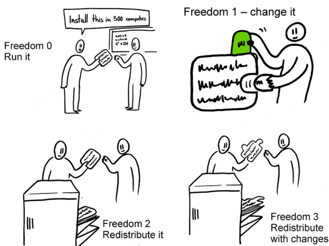
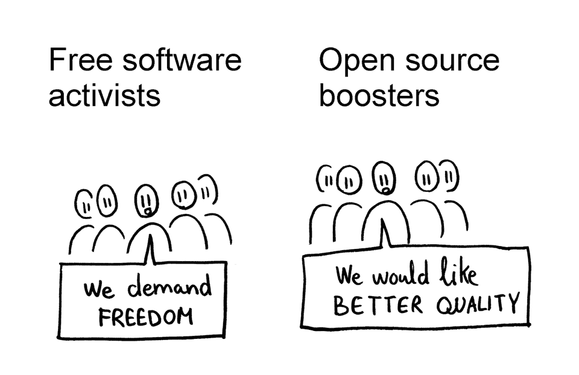

# About Free Software

## Introduction

Free software, often referred to as libre software[^libre], is a driving force behind innovation and collaboration in the digital world.

In this presentation, we will explore the concept, benefits, and impact of free software and see why it's better
than proprietary software. Also, we'll differentiate it from open-source software.

[^libre]: English speakers are often confused by
the term "free software" --- they think "free as
in price", but, in fact, it is "free as in freedom",
so it's easier to call it libre software.

## What is Free Software?

Free software, as defined by the Free Software Foundation (FSF), provides users with the freedom to use, study, modify, and distribute it freely. Unlike proprietary software, free software empowers users and respects their rights, promoting a cooperative and ethical approach to software development.

## The Four Freedoms of Free Software

{width=10cm}

## Freedoms 0 and 1 (separate control freedoms)

1. **Freedom 0: The Freedom to Run the Program**: Users have the right to run the software for any purpose. This freedom ensures that users are not restricted from utilizing the software as they see fit.

2. **Freedom 1: The Freedom to Study the Program**: Users can access and examine the source code, promoting transparency and learning. This freedom allows users to understand how the software functions and encourages exploration and knowledge sharing.

## Freedoms 2 and 3 (collective control freedoms)

3. **Freedom 2: The Freedom to Modify the Program**: Users can adapt and customize the software to suit their needs, promoting flexibility and innovation. This freedom empowers users to improve the software, fix bugs, and add new features.

4. **Freedom 3: The Freedom to Distribute the Program**: Users can share and distribute copies of the software, promoting collaboration and community building. This freedom allows users to help others, contribute to the software's development, and participate in a global community of users and developers.

# The contrast with proprietary software

## Proprietary software spies on it's users

For various reasons, including state
orders, marketing purposes or other goals --- *why* doesn't really matter,
knowing it does is already enough.

In fact, we've been brought to the point where
everybody knows they're being spied on and just doesn't care,
because it's forced on us so much!

## Proprietary software spies on it's users

There was a study in which people were
checking for a particular surveillance mechanism, which was easy
to detect without seeing the source code, by just running the app. Here are the results:

- of paid apps 60% were snooping;
- 90% of unpaid (gratis) apps were snooping.

## Not only spies on, but controls!

Here I can recall the event of Amazon erasing
1984 books from all people's devices.[^books]

They apologized after, but soon returned to doing
this.

[^books]: Fun fact: people, who
were reading the book at that moment, saw the book
disappear just in front of them!

## Non-free software is actually very limited

When developers don't allow people to tinker with their software,
it gets only as good as they manage to make it.

Writing programs behind closed doors enforces repeated code, multiple companies
reinventing the wheel at the same time, leading to employees
working long hours and underpaid.

*So it's essentialy producing worse code with more effort,
which is inherently dumb.*

On the contrary, most of free software developers
are volunteers, and the progress of a project is
really only limited by the number of people interested
in it!

# But what about Open-Source?

## The Difference: Free Software vs. Open-Source Software

While free software and open-source software share common goals, it's important to understand the distinction between the two:

- Free software emphasizes the ethical and user-focused aspects, highlighting the importance of user freedoms and community-driven development.

- Open-source software focuses on the practical benefits of openness, such as increased security, peer review, and faster innovation.

Richard Stallman, the founder of the Free Software Movement, emphasizes the ethical aspects and encourages the use of the term "free software" to emphasize freedom and user rights.

## The Difference: Free Software vs. Open-Source Software

{width=9cm}

## Conclusion

Free software stands as a testament to the power of collaboration, transparency, and user freedom in software development. By embracing free software, we enable individuals and communities to take control of their digital lives and promote a more inclusive and ethical digital society.

## See More

For more information about free software, you can visit the following resources:

- [Free Software Foundation (FSF)](https://www.fsf.org/): The FSF is a nonprofit organization dedicated to promoting and protecting free software.

- [GNU Project](https://www.gnu.org/), founded by Richard Stallman, develops a comprehensive collection of free software.
