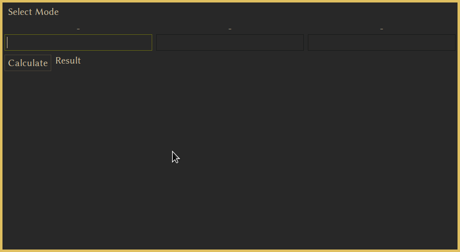
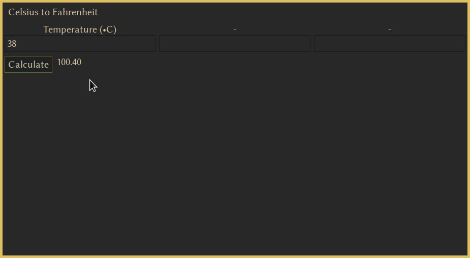
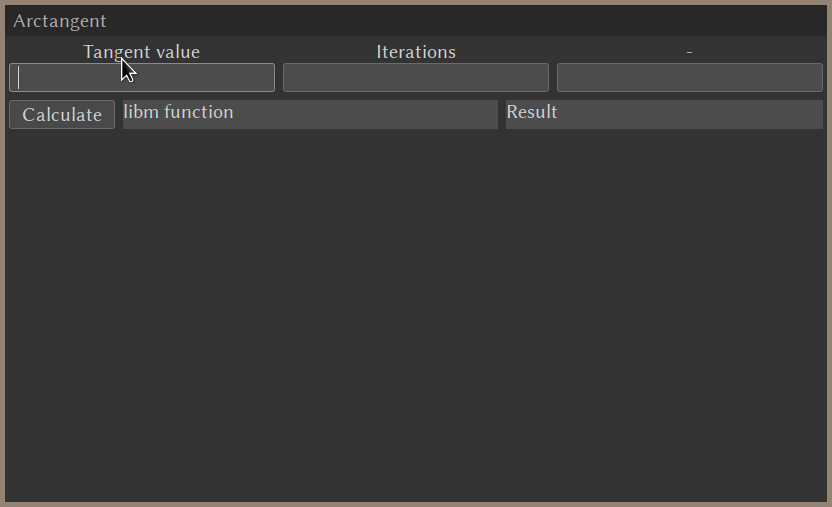
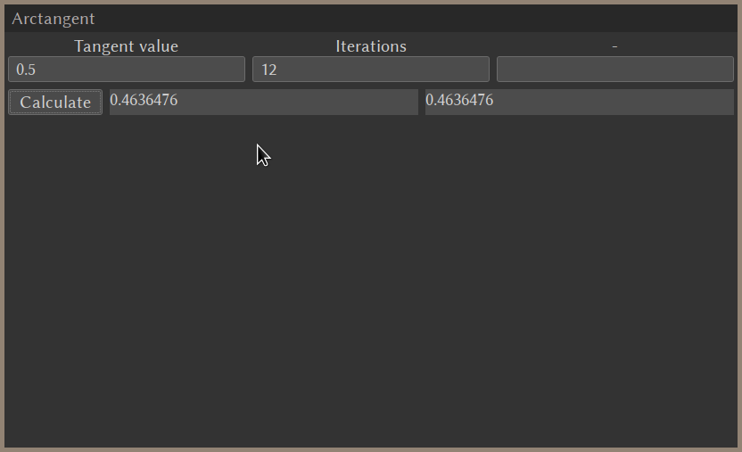
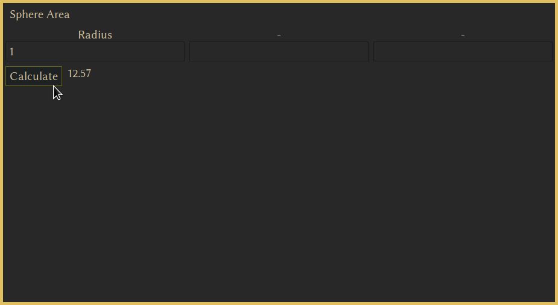
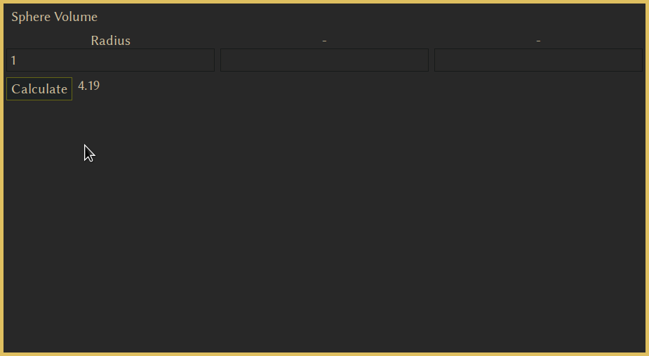
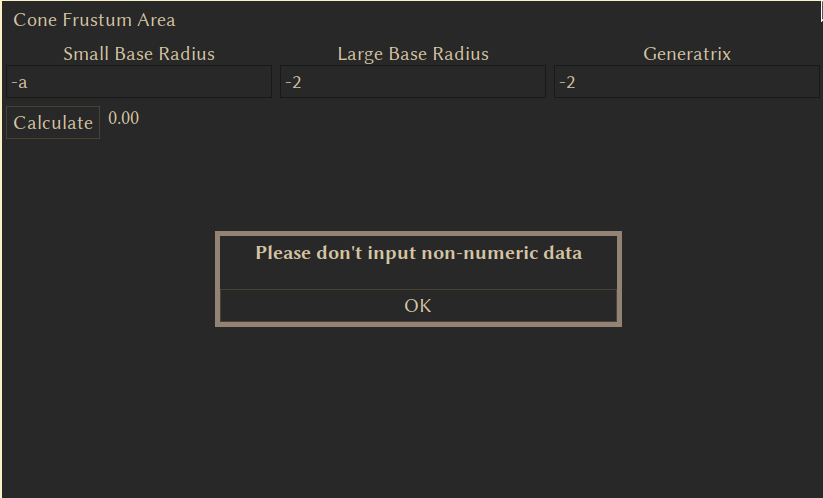
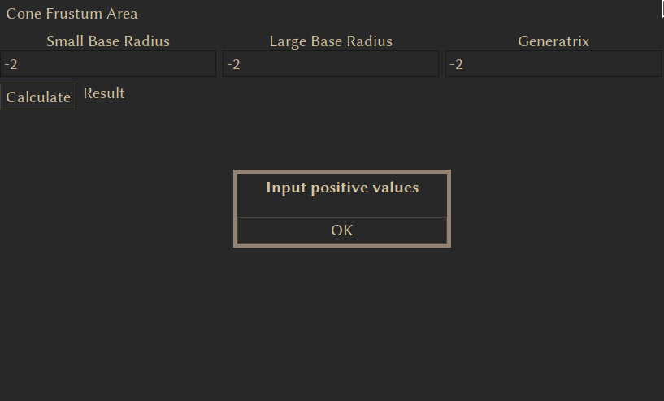
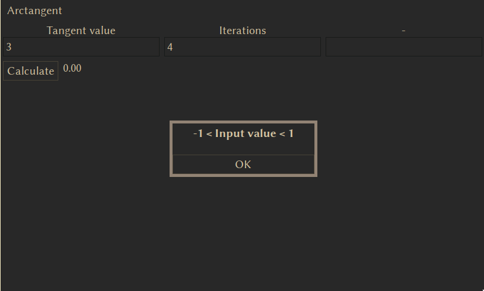

---
header-includes:
- \input{$HOME/Templates/lpnu_doc_templates/settings/preamble_md.tex}
- \input{$HOME/Templates/lpnu_doc_templates/settings/minted_settings.tex}
- \newcommand\Variant{4}
- \newcommand\Date{22.05.\the\year}
- \newcommand\Discipline{Об'єктно-орієнтоване програмування}
- \newcommand\Instructor{Патерега Ю. І.}
- \newcommand\Type{\Lab}
- \newcommand\Number{8}
- \newcommand\Topic{Динамічне під’єднання бібліотеки (DLL)}
- \setmonofont{Nimbus Roman}
---

\input{$HOME/Templates/lpnu_doc_templates/parts/header.tex}
Ознайомитись з методикою створення та використання dll-бібліотеки.

# Індивідуальне завдання

## Завдання 1

Написати програму для виконання геометричних обчислень відповідно до
власного варіанту. Створені функції для реалізації геометричних формул
виділити в dll-бібліотеку.

4. Обчислити площу повної поверхні зрізаного конуса, якщо відомі радіуси
нижньої та верхньої основи, твірна конуса.

## Завдання 2

Створимо DLL-бібліотеку на мові C++ та виклик її функції з Windows-проекту.

1. Створити рішення

2. Створити DLL-бібліотеку, яка містить функції, що необхідні для
реалізації індивідуального завдання.

3. Створити в тому ж рішенні Windows-проект, який викликає ці бібліотечні
методи для виконання необхідних обчислень. Форма для введення вхідних даних
та виведення результатів повинна бути достатньо інформативною, щоб
користувачу було зрозуміло, які саме обчислення і за якими формулами
виконуються у програмі.

4. При введенні вхідних даних перевіряти їх на допустимість значень.
Наприклад, якщо використовується операція ділення, перевіряти, щоб
знаменник не дорівнював нулю. Діапазони допустимих значень описати у звіті.
Проілюструвати скріншотами роботу програми на допустимих та недопустимих
значеннях вхідних даних (повідомлення про помилки, або невірно введені дані).

---

1. Реалізувати функцію перетворення температури у градусах Цельсія у
температуру у Фаренгейтах. Значення температури вводиться у формі, а
вихідна шкала обирається зі списку, шкала результату встановлюється
автоматично.

2. Обчислити функцію arctg(x) через ряд Тейлора:
$$
\arctg x = \sum_{n=0}^{\infty}\frac{(-1)^n}{(2n+1)!}x^{2n+1}
$$
для $|x|<1$.Значення x – дійсне число, n – ціле
(кількість членів ряду). Значення x та n вводяться у формі. Результат вивести
на форму разом з результатом, отриманим з застосуванням вбудованих функцій
для тригонометричних обчислень та порівняти їх для різних значень n.

3. Обчислити об’єм та площу поверхні кулі за заданим радіусом.

# Етапи розв'язку

1. Проаналізував завдання
	1. У 2 завданні знайшов помилку:
	функція $\arctg x$
	для $|x|<1$ насправді розкладається в ряд
	$\sum_{n=0}^{\infty}\frac{(-1)^n}{2n+1}x^{2n+1}$

	2. Також я поєднав перше та друге завдання в
	одній програмі, адже перше завдання --- просто
	створення функцій у динамічно під'єднуваній бібліотеці.
	Отже, я створив одну бібліотеку з функціями і з 1, і 2
	завдання.
2. Розпочав реалізацію. Для реалізації я не використав dll, адже
	в моїй системі, як у інших UNIX-подібних системах з тою
	самою метою існують спільні об'єкти (shared objects).
	Між ними є хіба різниця:
	DLL може визначати експортовані та внутрішні функції --- експортовані
	призначені для того, щоб їх викликали інші модулі та сама DLL, а внутрішні --- тільки для виклику всередині. Натомість в SO все доступне.
3. Для втілення графічного інтерфейсу користувача я використав gtkmm --- інтерфейс C++ для бібліотеки GTK.

## Код програми

### main.cc

\inputminted{c++}{src/main.cc}

### my_math.h

\inputminted{c++}{include/my_math.h}

### my_math.cc

\inputminted{c++}{src/my_math.cpp}

### window.h

\inputminted{c++}{include/window.h}

### window.cc

\inputminted{c++}{src/window.cc}

## Результат виконання програми

\clearpage

# Висновок

Я навчився розробляти динамічно приєднувані бібліотеки
та графічні інтерфейси (за допомогою Gtk).

# Відповіді на контрольні запитання
\begin{itemize}
	\question Що таке dll-бібліотека?
	\answer DLL-бібліотека - це файл, що містить код і дані, які можуть бути використані кількома програмами одночасно.

	\question Для чого використовуються dll-бібліотеки?
	\answer DLL-бібліотеки використовуються для розподілення коду і ресурсів між кількома програмами, зменшення розміру виконуваних файлів, полегшення розробки та підтримки.

	\question Яким чином експортується функція з dll-бібліотеки?
	\answer Функцію з dll-бібліотеки можна експортувати, використовуючи ключові слова або директиви, які дозволяють компілятору згенерувати інформацію про експорт функції у вихідний код DLL-бібліотеки.

	\question Яким чином імпортується функція з dll-бібліотеки?
	\answer Функцію з dll-бібліотеки можна імпортувати, використовуючи директиви або функції, що дозволяють програмі отримати доступ до функцій, що експортуються з DLL-бібліотеки.

	\question Скрита реалізація за допомогою lib та dll файлів?
	\answer Використання lib (Static Library) та dll (Dynamic Link Library) файлів дозволяє розподілити код і ресурси між програмами. Статичні бібліотеки компілюються безпосередньо в виконуваний файл програми, тоді як динамічні бібліотеки завантажуються під час виконання програми.
\end{itemize}
